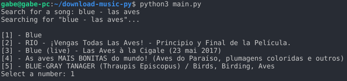

# download-music-py

> Download youtube songs without much effort.

A console app that lets you browse and download songs that are on youtube without seeing ads or entering dubious websites.



## Requirement

- python 3.6
- pip3 (dependencias: `youtube_dl` and `beautifulsoup4`)

## Installation

OS X & Linux:

```sh
sudo apt install python3-bs4
sudo apt install youtube-dl
```

Windows:

```sh
pip3 install youtube_dl beautifulsoup4
```

## Usage example

```sh
python main.py
```

## Contributing

1. Fork it (<https://github.com/yourname/yourproject/fork>)
2. Create your feature branch (`git checkout -b feature/fooBar`)
3. Commit your changes (`git commit -am 'Add some fooBar'`)
4. Push to the branch (`git push origin feature/fooBar`)
5. Create a new Pull Request
